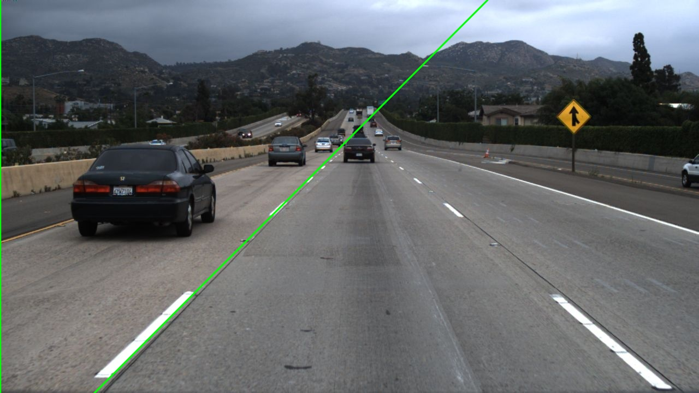

# Nishan-e-Sarak

> _A project I made_ \
> _For a certain kind of person_
>
> _To spite them_



Motorcyclists, the certain kind of person is motorcyclists. Yes, I am acutely
aware this program doesn't run all that well at the moment.

## Usage

```bash
git clone https://github.com/masroof-maindak/nishan-e-sarak.git
cd nishan-e-sarak
mkdir build && cd build
cmake -DCMAKE_BUILD_TYPE=Release .. # Or 'Debug' if you want to hack away.
cmake --build .
./nshn -i <input-image> -o <output-dir>
```

## Dependencies

- OpenCV
- QT6
- VTK
- HDF5

#### Arch Linux

```bash
sudo pacman -S opencv qt6-base vtk hdf5
```

## Acknowledgements

- [ArgParse](https://github.com/p-ranav/argparse)
- [Understanding Hough Transform - Alyssa Quek](https://alyssaq.github.io/2014/understanding-hough-transform/)
